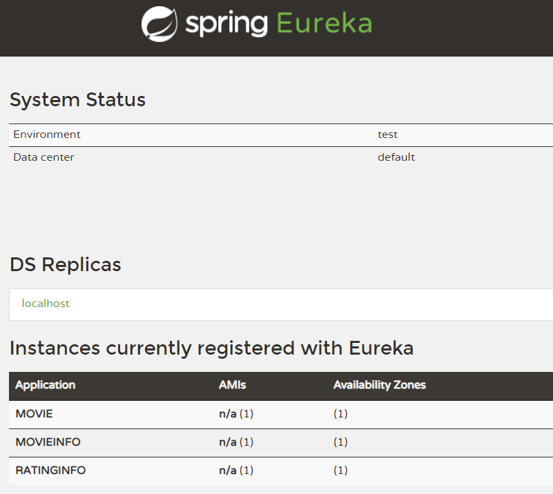

# Spring-microservice-simple-movie
A very simple microservice that build by Spring Boot

Include three microservices:
1. rating service return hard coding rating infomation
2. movie-info service return hard coding movie information
3. movie-service combine the raing and movie infomarion

stand up all three service and using Eureka as the client side dicovery

 

